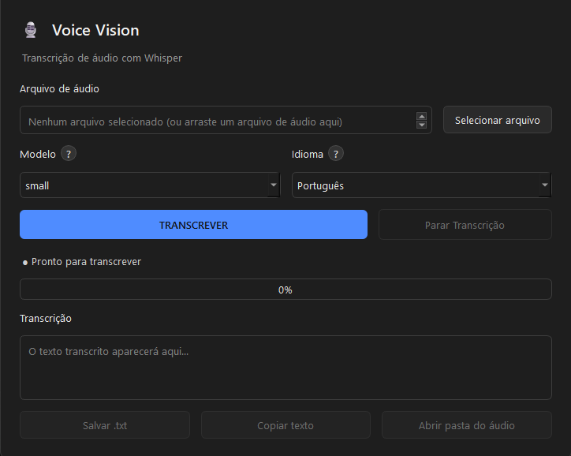

# 🎙️ Voice Vision

Aplicação desktop para Windows que realiza transcrição de áudio para texto
localmente, sem envio de dados para serviços externos. Utiliza
[faster-whisper](https://github.com/SYSTRAN/faster-whisper) (reimplementação
otimizada do Whisper via CTranslate2) para inferência em CPU, com interface
gráfica em PySide6 (Qt) e tema escuro nativo.


[](https://github.com/SEU-USUARIO/voice-vision/releases/latest)
[](https://github.com/SEU-USUARIO/voice-vision/releases/latest)

### [⬇️ Download](https://github.com/SEU-USUARIO/voice-vision/releases/latest)

Instalador Windows (`VoiceVision-Setup-x.x.x.exe`) disponível na seção
"Assets" da release mais recente. Não requer Python ou dependências
instaladas — a distribuição é autocontida.



## Sumário

- [Download](#-download)
- [Funcionalidades](#funcionalidades)
- [Ambiente de desenvolvimento](#ambiente-de-desenvolvimento)
- [Build do executável](#build-do-executável)
- [Geração do instalador](#geração-do-instalador-inno-setup)
- [Estrutura do projeto](#estrutura-do-projeto)
- [Licença](#licença)

## Estrutura do projeto

```
VoiceVision/
├── main.py                   # entry point: inicialização do Qt, tema, ícone
├── paths.py                  # resolução de caminhos de recursos (dev/frozen)
├── requirements.txt          # dependências de runtime
├── requirements-build.txt    # dependências exclusivas do processo de build
├── build.bat                 # automação do empacotamento (PyInstaller)
├── VoiceVision.spec          # configuração do PyInstaller
├── VoiceVision.iss           # script de geração do instalador (Inno Setup)
├── assets/
│   └── icon.ico               # ícone da aplicação
├── ui/
│   └── main_window.py         # camada de apresentação (PySide6)
└── services/
    └── transcriber.py         # camada de domínio (faster-whisper)
```

A separação entre `ui/` e `services/` isola a lógica de transcrição da
camada de interface — `services/transcriber.py` não possui nenhuma
dependência de Qt, o que facilita testes unitários e eventual reuso em
outro front-end (CLI, API, etc.).

## Ambiente de desenvolvimento

Requisitos: Python 3.12+.

```powershell
cd VoiceVision
python -m venv .venv
.venv\Scripts\activate
pip install -r requirements.txt
python main.py
```

## Funcionalidades

- Seleção de arquivo de áudio via diálogo ou drag-and-drop (`.mp3`, `.wav`,
  `.m4a`, `.ogg`, `.flac`)
- Seleção de modelo (`tiny`/`base`/`small`/`medium`) e idioma, com ajuda
  contextual (botão "?") descrevendo o trade-off de cada opção
- Transcrição executada em thread dedicada (`QThread`), sem bloqueio da UI
- Cancelamento de transcrição em andamento (parada no limite do segmento
  atual)
- Progresso calculado a partir da posição temporal já processada no áudio
- Persistência de preferências (modelo, idioma, último diretório usado)
  entre execuções via `QSettings`
- Exportação da transcrição para `.txt` ou cópia direta para a área de
  transferência
- Tema escuro aplicado via `QPalette`, incluindo diálogos nativos do
  sistema operacional
- Ícone de aplicação consistente na barra de tarefas, tanto em modo
  desenvolvimento quanto empacotado
- Tratamento de exceções com feedback ao usuário via `QMessageBox`, inclusive
  na inicialização (relevante em builds "windowed", sem console associado)

O carregamento do modelo é postergado até o primeiro clique em
"Transcrever" (lazy loading), evitando consumo de memória com a aplicação
ociosa. A instância do modelo é reutilizada entre transcrições subsequentes
na mesma sessão.

### Cálculo de progresso

O faster-whisper expõe, por segmento processado, o timestamp de término
(`segment.end`). O percentual exibido é derivado de
`segment.end / duração_total_do_áudio`— uma estimativa baseada em cobertura
temporal do áudio, não em uso de CPU ou tempo de execução.

### Semântica do cancelamento

A transcrição é interrompida entre segmentos, não durante o processamento
de um segmento individual — limitação da API do faster-whisper, que não
expõe pontos de interrupção mais granulares. O texto parcial gerado até o
cancelamento é descartado; não há suporte a resultados parciais.

### Theming

O tema escuro é implementado via `QPalette` (função `_aplicar_tema_escuro`
em `main.py`), não via stylesheet isolado. Essa abordagem propaga o tema
para diálogos nativos renderizados pelo Qt (seleção de arquivo, caixas de
mensagem), garantindo consistência visual em toda a superfície da aplicação.

### Persistência de configurações

`QSettings` grava no repositório de configurações padrão do sistema
operacional — no Windows, no registro, em
`HKEY_CURRENT_USER\Software\VoiceVision\VoiceVision`.

### Armazenamento de modelos

Os modelos do Whisper são armazenados em um diretório fixo,
independente do cache padrão do `huggingface_hub`:

```
%LOCALAPPDATA%\VoiceVision\modelos
```

Essa escolha garante um local previsível tanto em execução via
`python main.py` quanto no binário empacotado, e preserva os modelos
baixados entre reinstalações do aplicativo (ver ressalva na seção de
instalador). O caminho é exposto como tooltip na barra de status da UI.

A estratégia adotada é download sob demanda (na primeira execução com um
modelo ainda não baixado), o que mantém o instalador inicial compacto ao
custo de exigir conectividade na primeira transcrição de cada modelo.
Empacotamento offline (modelo embutido no instalador) é possível adicionando
os arquivos do modelo em `datas` no `.spec` e ajustando `download_root`.

---

## Build do executável

### Via `build.bat`

Automatiza o processo completo: criação de ambiente virtual (se ausente),
instalação de dependências, limpeza de builds anteriores e execução do
PyInstaller com a configuração de `VoiceVision.spec`.

```powershell
build.bat
```

Saída:

```
dist\VoiceVision\VoiceVision.exe
```

Para distribuição sem instalador, a pasta `dist\VoiceVision` deve ser
copiada integralmente — o executável depende dos artefatos adjacentes
(bibliotecas nativas do CTranslate2, entre outros).

### Rationale do `.spec`

`faster-whisper` depende de `ctranslate2`, que inclui bibliotecas nativas
(`.dll`) e arquivos de dados não detectados automaticamente pela análise
estática do PyInstaller. `VoiceVision.spec` resolve isso via `collect_all()`
para os seguintes pacotes:

- `faster_whisper`
- `ctranslate2`
- `av` — decodificação de áudio
- `tokenizers`
- `huggingface_hub`

O modo de empacotamento escolhido é **onedir** (diretório com o executável
e suas dependências) em vez de **onefile**. Onefile exige descompactação em
diretório temporário a cada inicialização, o que aumenta o tempo de startup
e é uma fonte comum de falhas de carregamento de DLL em dependências nativas
volumosas como as do CTranslate2. Onedir é a configuração recomendada para
esse perfil de dependências, e é o artefato consumido diretamente pelo
Inno Setup na etapa seguinte.

### Diagnóstico de problemas de build

| Sintoma | Causa provável / ação |
|---|---|
| `ModuleNotFoundError` ao executar o `.exe` | Dependência ausente em `collect_all`. Execute `dist\VoiceVision\VoiceVision.exe` via terminal (não por duplo clique) para capturar o traceback completo. |
| SmartScreen/antivírus sinalizando o executável | Comportamento esperado para binários PyInstaller sem assinatura de código; não indica comprometimento. |
| Build lento ou artefato volumoso | Esperado — CTranslate2 e dependências de ML somam algumas centenas de MB no diretório final. |
| Falha silenciosa na inicialização | `main.py` captura exceções de inicialização e as exibe via `QMessageBox` (necessário em build "windowed", sem console). Caso persista sem feedback, execute via terminal. |

---

## Geração do instalador (Inno Setup)

`VoiceVision.iss` empacota `dist\VoiceVision` em um instalador único
(`VoiceVision-Setup-x.x.x.exe`) com atalhos de menu, registro em
"Aplicativos instalados" e desinstalador.

### 1. Instalação do Inno Setup

Compilador gratuito: https://jrsoftware.org/isdl.php

### 2. Pré-requisito: build gerado

`VoiceVision.iss` referencia `dist\VoiceVision` — execute `build.bat`
previamente.

### 3. Compilação

Via interface (Inno Setup Compiler): abrir `VoiceVision.iss` e executar
**Build > Compile** (`Ctrl+F9`).

Via linha de comando:

```powershell
"C:\Program Files (x86)\Inno Setup 6\ISCC.exe" VoiceVision.iss
```

Saída:

```
instalador\VoiceVision-Setup-1.0.0.exe
```

Artefato final para distribuição.

### Configuração do instalador

- Metadados (nome, versão, ícone) consistentes com o restante do projeto
  (`assets\icon.ico`)
- Instalação em `Arquivos de Programas\Voice Vision`, sem exigência de
  privilégio administrativo (`PrivilegesRequired=lowest`)
- Atalho de Menu Iniciar por padrão; atalho de Área de Trabalho como tarefa
  opcional (desmarcada por padrão)
- Desinstalação completa, incluindo o diretório de instalação **e** o
  diretório de modelos (`%LOCALAPPDATA%\VoiceVision`) — nenhum artefato
  remanescente após desinstalar
- Assistente localizado em português (pacote `BrazilianPortuguese` do
  Inno Setup)
- Execução opcional da aplicação ao término da instalação

**Implicação da limpeza completa:** como os modelos baixados são removidos
na desinstalação, uma reinstalação subsequente exige novo download. Para
preservar modelos entre desinstalações, remover a segunda entrada do bloco
`[UninstallDelete]` em `VoiceVision.iss`.

### Versionamento

Ao publicar uma nova versão, atualizar `#define MyAppVersion` no início de
`VoiceVision.iss` antes de recompilar. O `AppId` é fixo e não deve ser
alterado — é ele que permite ao Windows tratar instalações subsequentes
como atualização do mesmo aplicativo, em vez de uma instalação paralela.

---

## Licença

Distribuído sob licença MIT — ver [LICENSE](LICENSE).
